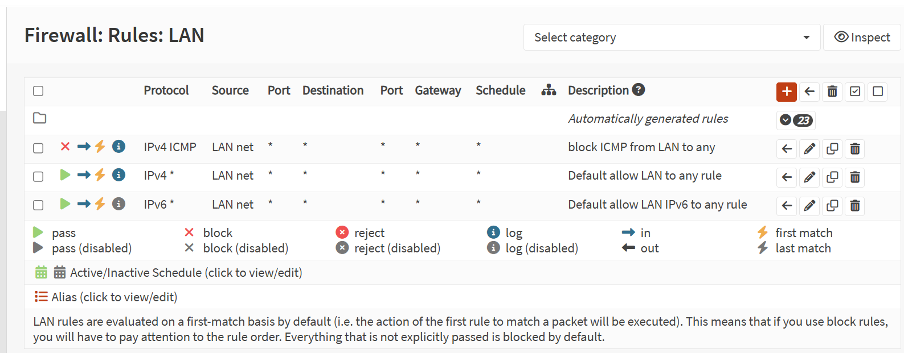
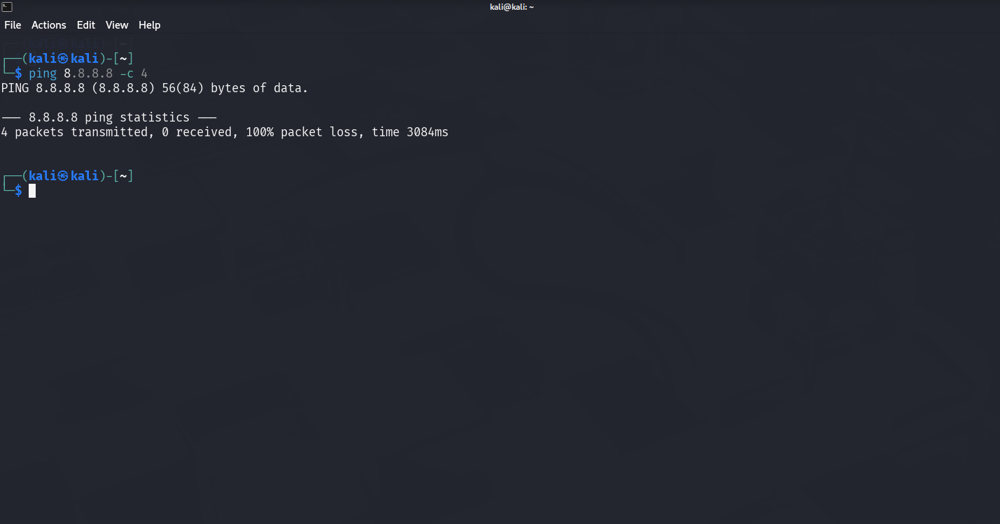

# Lab 04 – Block ICMP Traffic Using OPNsense

## Objective

Create and test a firewall rule in OPNsense to block ICMP (Ping) traffic from the LAN network.

---

## Lab Environment

- Firewall: OPNsense 26.1
- Hypervisor: VMware Workstation
- Client Machine: Kali Linux
- LAN Network: 192.168.105.0/24

---

## Rule Configuration

| Parameter | Value |
|-----------|-------|
| Action | Block |
| Interface | LAN |
| Direction | In |
| IP Version | IPv4 |
| Protocol | ICMP |
| Source | LAN net |
| Destination | Any |
| Logging | Enabled |

---

## Rule Order

The ICMP block rule was moved above the default LAN allow rule.

This is required because OPNsense evaluates firewall rules from top to bottom (First Match).

---

## Testing

### Before applying the rule

Result:

- Ping successful

---

### After applying the rule

Result:

- ICMP traffic blocked successfully

---

## Skills Learned

- Firewall rule creation
- Rule priority
- First Match processing
- ICMP filtering
- Firewall validation
- Traffic testing using Kali Linux

---

## Conclusion

The firewall successfully blocked ICMP traffic originating from the LAN network after the rule was moved above the default allow rule.
## Screenshots

### Firewall Rule

### Rule Order

### ICMP Test

