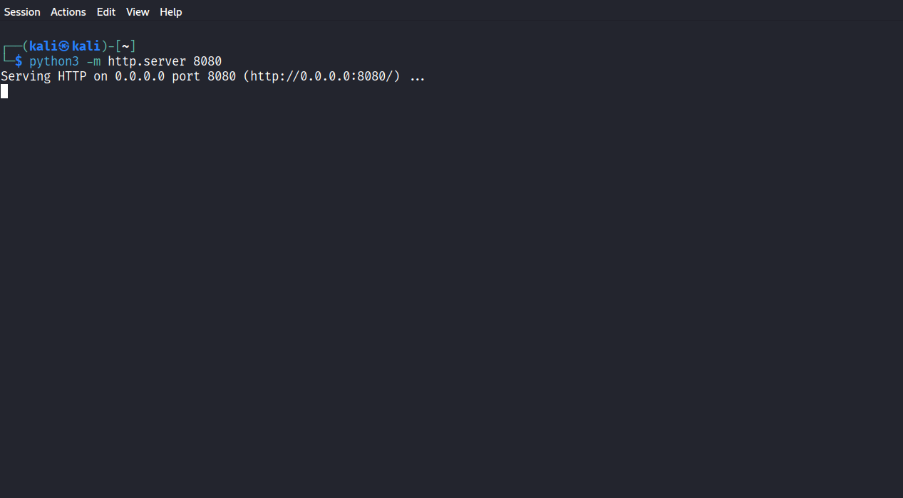

# Lab 06: Source NAT (Outbound NAT) Configuration in OPNsense

## Lab Overview

This lab demonstrates how to configure Source Network Address Translation (SNAT), also known as Outbound NAT, in OPNsense. A manual Source NAT rule is created to translate the private IP address of the Kali Linux machine into the WAN IP address of the OPNsense firewall before forwarding traffic to another network. This configuration allows internal devices to communicate with external networks while hiding their original private IP addresses.

## Lab Objectives

- Understand the concept of Source Network Address Translation (SNAT).
- Configure Hybrid Outbound NAT mode in OPNsense.
- Create a manual Source NAT rule.
- Translate the source IP address of Kali Linux to the WAN IP address of OPNsense.
- Verify the NAT translation using connectivity tests and firewall states.

## Prerequisites

- VMware Workstation
- OPNsense Firewall
- Kali Linux Virtual Machine
- Ubuntu Virtual Machine
- Python 3 installed on Kali Linux
- Basic understanding of IP addressing and NAT concepts

## Environment

| Device | IP Address | Purpose |
|---------|------------|---------|
| OPNsense WAN | 192.168.152.130 | WAN Interface |
| OPNsense LAN | 192.168.105.2 | LAN Gateway |
| Kali Linux | 192.168.105.19 | HTTP Server |
| Ubuntu | 192.168.152.132 | Testing Client |
| Windows Host | 192.168.0.105 | VMware Host Machine |

## Network Topology

                     Windows Host
                     192.168.0.105
                           │
                     VMware VMnet8 (NAT)
                    192.168.152.0/24
                           │
                WAN (OPNsense - em0)
                  192.168.152.130
                           │
                   ┌────────────────┐
                   │   OPNsense     │
                   │    Firewall    │
                   └────────────────┘
                           │
                 LAN (OPNsense - em1)
                    192.168.105.2
                           │
                VMware VMnet1 (Host-only)
                    192.168.105.0/24
                           │
                     Kali Linux
                  192.168.105.19

                     Ubuntu
                 192.168.152.132
               (Connected to VMnet8)
               ## Configuration Steps

### Step 1: Start the HTTP Server on Kali Linux

Before configuring Source NAT, a Python HTTP server was started on the Kali Linux virtual machine. This server listens on TCP port **8080** and is used to verify network connectivity during the lab.

Run the following command on Kali Linux:

python3 -m http.server 8080

After executing the command, the server starts listening on all network interfaces.

Serving HTTP on 0.0.0.0 port 8080 (http://0.0.0.0:8080/)

**Expected Result**

The Python HTTP server starts successfully and waits for incoming HTTP requests on TCP port **8080**.

**Screenshot**

> Figure 1: Python HTTP server running on Kali Linux.
> 
### Step 2: Configure Hybrid Outbound NAT

Log in to the OPNsense web interface and navigate to:

Firewall → NAT → Outbound

By default, OPNsense operates in **Automatic Outbound NAT** mode, where the firewall automatically generates the required Source NAT rules.

To create a custom Source NAT rule without removing the automatically generated rules, the Outbound NAT mode was changed to **Hybrid Outbound NAT rule generation**.

After selecting **Hybrid Outbound NAT rule generation**, click **Save**, then click **Apply Changes**.

**Expected Result**

Hybrid mode is enabled, allowing both automatic and manually created Source NAT rules to coexist.

**Screenshot**

> Figure 2: Hybrid Outbound NAT mode enabled.
> 

> ### Step 3: Create a Manual Source NAT Rule

After enabling Hybrid Outbound NAT mode, a manual Source NAT rule was created for the Kali Linux virtual machine.

Navigate to:

Firewall → NAT → Outbound

Click **+ Add** and configure the following parameters:

| Parameter | Value |
|-----------|-------|
| Interface | WAN |
| Source | 192.168.105.19/32 |
| Source Port | Any |
| Destination | Any |
| Destination Port | Any |
| Translation / Address | WAN Address |
| Translation / Port | Any |
| Static Port | Disabled |
| Description | SNAT for Kali |

After completing the configuration, click **Save**, then **Apply Changes**.

**Expected Result**

A manual Source NAT rule is successfully added to the Outbound NAT table and will be applied only to the Kali Linux virtual machine.

**Screenshot**

> Figure 3: Manual Source NAT rule configured in OPNsense.
> 

> ## Testing and Verification

After applying the manual Source NAT rule, several tests were performed to verify that the configuration was working correctly.

### Test 1: Verify HTTP Connectivity

The Ubuntu virtual machine, connected to the WAN network, was used as the testing client.

A web browser was opened and the following URL was accessed:

http://192.168.152.130:8080

The request successfully reached the Python HTTP server running on the Kali Linux machine through the OPNsense firewall.

**Expected Result**

The Python HTTP server displays the **Directory Listing** page, confirming that the connection between the WAN and LAN networks is functioning correctly.

**Screenshot**

> Figure 4: Ubuntu successfully accessing the Python HTTP server through the OPNsense firewall.
> 

> ### Test 2: Verify Firewall States

To confirm that Source NAT was being applied correctly, the active firewall states were examined.

Navigate to:

Firewall → Diagnostics → States

The active connection created by the HTTP request was displayed in the firewall state table.

The state table confirmed that OPNsense translated the source IP address before forwarding the traffic.

**Expected Result**

The firewall state entry confirms that the Source NAT rule is active and that traffic is successfully translated while passing through the WAN interface.

**Screenshot**

> Figure 5: Firewall states showing the active Source NAT session.
> 

> ## Packet Flow Analysis

The packet processing sequence is illustrated below.

### Before Source NAT

Source IP      : 192.168.105.19
Destination IP : 192.168.152.132

At this stage, the packet originates from the Kali Linux virtual machine located on the LAN network.

### After Source NAT

Source IP      : 192.168.152.130
Destination IP : 192.168.152.132

OPNsense replaces the original source IP address of the packet with its WAN interface IP address before forwarding the traffic to the destination.

The destination IP address remains unchanged.

This translation allows devices on different networks to communicate without exposing the internal private IP address of the source host.
## Results

The Source NAT configuration was successfully implemented and verified.

The following objectives were achieved:

- Hybrid Outbound NAT mode was successfully enabled.
- A manual Source NAT rule was created for the Kali Linux virtual machine.
- The private IP address of Kali Linux was translated to the WAN IP address of OPNsense.
- HTTP connectivity between Kali Linux and Ubuntu was successfully verified.
- Firewall state inspection confirmed that the Source NAT rule was applied correctly.
- ## Key Learning Points

This lab provided practical experience with Source Network Address Translation (SNAT) in OPNsense.

The following concepts were learned:

- Difference between Source NAT and Destination NAT.
- Purpose of Hybrid Outbound NAT mode.
- Creation of manual Source NAT rules.
- Translation of the source IP address during packet forwarding.
- Verification of NAT operation using Firewall States.
- Practical implementation of Source NAT in a virtual enterprise network.
- ## Conclusion

In this lab, a manual Source NAT rule was successfully configured using Hybrid Outbound NAT mode in OPNsense.

Traffic originating from the Kali Linux virtual machine was translated to the WAN IP address of the firewall before being forwarded to the destination network.

The successful verification using HTTP connectivity tests and Firewall States confirmed that the Source NAT configuration was operating as expected.

This lab strengthened the understanding of how Source NAT enables communication between private and external networks while protecting internal IP addressing.
