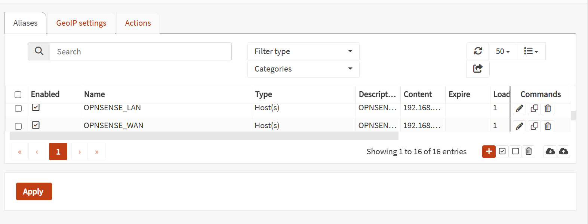
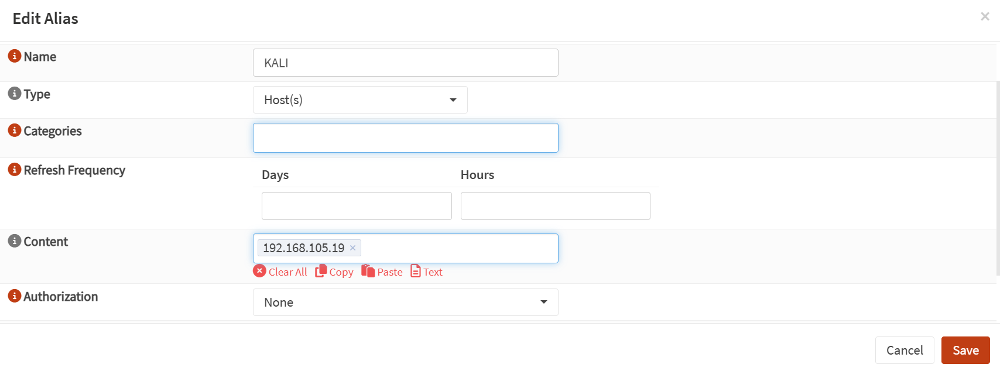
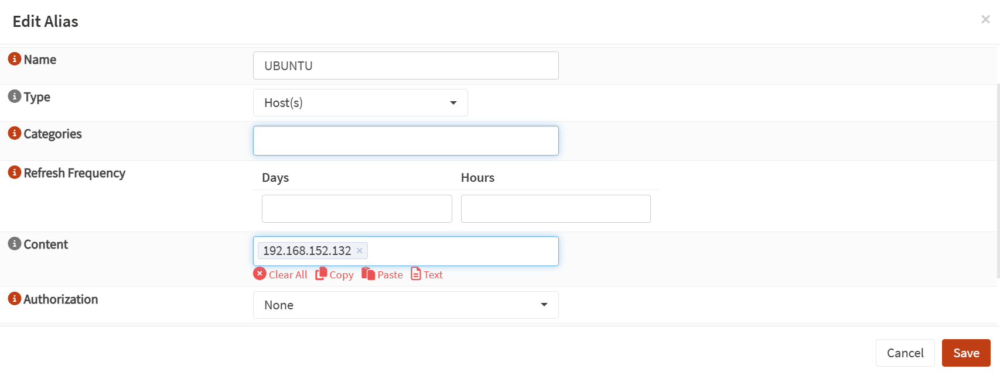
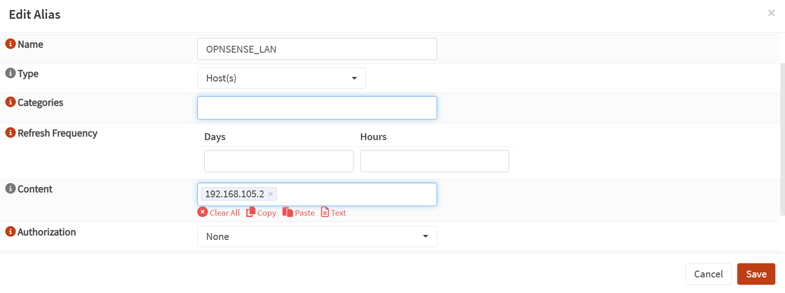
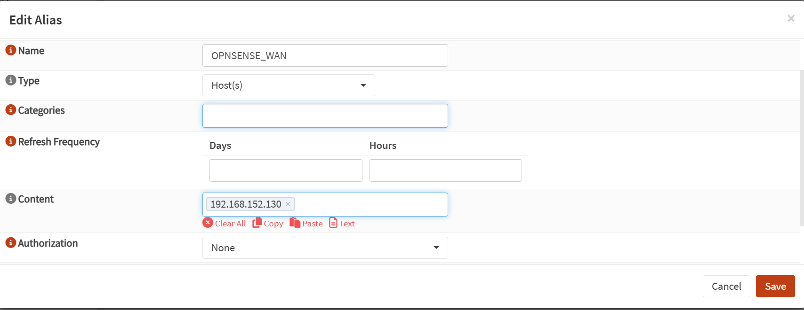
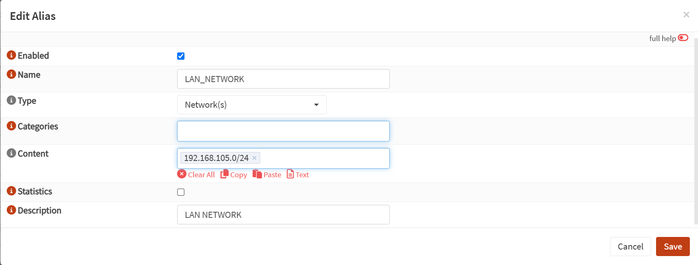
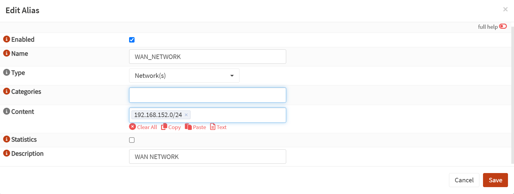
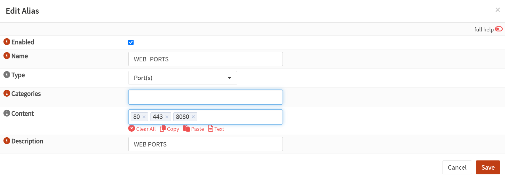
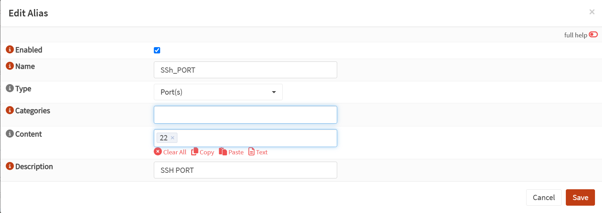

# Lab 07: Firewall Aliases in OPNsense

## Lab Overview

This lab demonstrates how to create and manage Firewall Aliases in OPNsense. Firewall aliases simplify firewall rule management by grouping hosts, networks, and ports into reusable objects. Instead of using IP addresses and port numbers directly in firewall rules, aliases provide meaningful names, making firewall policies easier to read, maintain, and troubleshoot.

---

## Lab Objectives

- Understand the purpose of Firewall Aliases.
- Create Host aliases for network devices.
- Create Network aliases for LAN and WAN networks.
- Create Port aliases for common services.
- Learn how aliases simplify firewall rule management.
- Prepare reusable objects for future firewall rules.

---

## Prerequisites

- VMware Workstation
- OPNsense Firewall installed
- Kali Linux Virtual Machine
- Ubuntu Virtual Machine
- Basic understanding of IP addressing
- Completed previous OPNsense firewall and NAT laboratories

---

## Environment

| Device | IP Address | Purpose |
|---------|------------|---------|
| Windows Host | 192.168.0.105 | VMware Host |
| OPNsense WAN | 192.168.152.130 | Firewall WAN Interface |
| OPNsense LAN | 192.168.105.2 | Firewall LAN Interface |
| Kali Linux | 192.168.105.19 | Security Workstation |
| Ubuntu | 192.168.152.132 | Testing Client |

---

## Network Topology

```text
                          Internet
                              │
                        Wi-Fi Router
                        192.168.0.1
                              │
                    Windows Host (VMware)
                    192.168.0.105
                              │
                    VMnet8 (NAT Network)
                    192.168.152.0/24
                              │
                   OPNsense WAN (em0)
                    192.168.152.130
                              │
                     ┌─────────────────┐
                     │    OPNsense     │
                     │    Firewall     │
                     └─────────────────┘
                              │
                   OPNsense LAN (em1)
                     192.168.105.2
                              │
                  VMnet1 (Host-Only Network)
                    192.168.105.0/24
                              │
                 ┌────────────┴────────────┐
                 │                         │
            Kali Linux                 Ubuntu
         192.168.105.19             192.168.152.132
```

---
## Configuration Steps

### Step 1: Navigate to Firewall Aliases

Log in to the OPNsense web interface and navigate to:

```text
Firewall → Aliases
```

The Firewall Aliases page displays all existing aliases and provides options to create, edit, or delete aliases.

Aliases simplify firewall management by replacing IP addresses, networks, and port numbers with meaningful names.

**Expected Result**

The Firewall Aliases page is displayed successfully.

**Screenshot**

> Figure 1: Firewall Aliases page.
> 

> ### Step 2: Create Host Alias - KALI

Configure the following Host alias:

| Parameter | Value |
|-----------|-------|
| Name | KALI |
| Type | Host(s) |
| IP Address | 192.168.105.19 |
| Description | Kali Linux workstation |

**Figure 2: Host Alias - KALI**



### Step 3: Create Host Alias - UBUNTU

A Host alias was created for the Ubuntu virtual machine. Ubuntu is used as the testing client throughout the OPNsense home lab to verify network connectivity and firewall configurations.

Navigate to:

```text
Firewall → Aliases
```

Click **+ Add** and configure the following settings:

| Parameter | Value |
|-----------|-------|
| Enabled | Yes |
| Name | UBUNTU |
| Type | Host(s) |
| Categories | Leave empty |
| Refresh Frequency | Default |
| Content | 192.168.152.132 |
| Description | Ubuntu testing client |

After completing the configuration, click **Save** and then **Apply Changes**.

Creating a Host alias allows firewall rules to reference **UBUNTU** instead of the IP address **192.168.152.132**, improving readability and simplifying future firewall management.

**Expected Result**

The **UBUNTU** alias is successfully created and displayed in the Firewall Aliases table.

**Figure 3: Host Alias – UBUNTU**



### Step 4: Create Host Alias - OPNSENSE_LAN

A Host alias was created for the LAN interface of the OPNsense firewall. This alias represents the default gateway for devices connected to the internal LAN network.

Navigate to:

```text
Firewall → Aliases
```

Click **+ Add** and configure the following settings:

| Parameter | Value |
|-----------|-------|
| Enabled | Yes |
| Name | OPNSENSE_LAN |
| Type | Host(s) |
| Categories | Leave empty |
| Refresh Frequency | Default |
| Content | 192.168.105.2 |
| Description | OPNsense LAN interface |

After completing the configuration, click **Save** and then **Apply Changes**.

Creating this alias makes future firewall rules easier to understand by using **OPNSENSE_LAN** instead of the IP address **192.168.105.2**.

**Expected Result**

The **OPNSENSE_LAN** alias is successfully created and appears in the Firewall Aliases table.

**Figure 4: Host Alias – OPNSENSE_LAN**



### Step 5: Create Host Alias - OPNSENSE_WAN

A Host alias was created for the WAN interface of the OPNsense firewall. This alias represents the firewall's external interface connected to the VMware NAT network.

Navigate to:

```text
Firewall → Aliases
```

Click **+ Add** and configure the following settings:

| Parameter | Value |
|-----------|-------|
| Enabled | Yes |
| Name | OPNSENSE_WAN |
| Type | Host(s) |
| Categories | Leave empty |
| Refresh Frequency | Default |
| Content | 192.168.152.130 |
| Description | OPNsense WAN interface |

After completing the configuration, click **Save** and then **Apply Changes**.

Creating this alias makes future firewall rules easier to understand by using **OPNSENSE_WAN** instead of the IP address **192.168.152.130**.

**Expected Result**

The **OPNSENSE_WAN** alias is successfully created and appears in the Firewall Aliases table.

**Figure 5: Host Alias – OPNSENSE_WAN**



### Step 6: Create Network Alias - LAN_NETWORK

A Network alias was created for the internal LAN subnet. This alias represents the entire LAN network and can be used in firewall rules instead of specifying the network address manually.

Navigate to:

```text
Firewall → Aliases
```

Click **+ Add** and configure the following settings:

| Parameter | Value |
|-----------|-------|
| Enabled | Yes |
| Name | LAN_NETWORK |
| Type | Network(s) |
| Categories | Leave empty |
| Refresh Frequency | Default |
| Content | 192.168.105.0/24 |
| Description | LAN network |

After completing the configuration, click **Save** and then **Apply Changes**.

Using a Network alias allows firewall rules to reference the entire LAN subnet by using **LAN_NETWORK** instead of the network address **192.168.105.0/24**. This improves readability and simplifies future firewall administration.

**Expected Result**

The **LAN_NETWORK** alias is successfully created and appears in the Firewall Aliases table.

**Figure 6: Network Alias – LAN_NETWORK**



### Step 7: Create Network Alias - WAN_NETWORK

A Network alias was created for the WAN subnet used by the OPNsense firewall. This alias represents the VMware NAT network and can be referenced in firewall rules instead of using the network address directly.

Navigate to:

```text
Firewall → Aliases
```

Click **+ Add** and configure the following settings:

| Parameter | Value |
|-----------|-------|
| Enabled | Yes |
| Name | WAN_NETWORK |
| Type | Network(s) |
| Categories | Leave empty |
| Refresh Frequency | Default |
| Content | 192.168.152.0/24 |
| Description | WAN network |

After completing the configuration, click **Save** and then **Apply Changes**.

Using a Network alias allows firewall rules to reference the entire WAN subnet by using **WAN_NETWORK** instead of the network address **192.168.152.0/24**. This makes firewall policies easier to read, maintain, and update if the network configuration changes.

**Expected Result**

The **WAN_NETWORK** alias is successfully created and appears in the Firewall Aliases table.

**Figure 7: Network Alias – WAN_NETWORK**



### Step 8: Create Port Alias - WEB_PORTS

A Port alias was created to group the most commonly used web service ports into a single reusable object. Instead of specifying multiple ports in every firewall rule, the **WEB_PORTS** alias can be referenced directly.

Navigate to:

```text
Firewall → Aliases
```

Click **+ Add** and configure the following settings:

| Parameter | Value |
|-----------|-------|
| Enabled | Yes |
| Name | WEB_PORTS |
| Type | Port(s) |
| Categories | Leave empty |
| Refresh Frequency | Default |
| Content | 80, 443, 8080 |
| Description | Web ports |

> **Note:** Depending on the OPNsense version, multiple ports can be entered either as comma-separated values or one port per line.

After completing the configuration, click **Save** and then **Apply Changes**.

The **WEB_PORTS** alias groups the following services:

| Port | Service |
|------|---------|
| 80 | HTTP |
| 443 | HTTPS |
| 8080 | Alternative HTTP |

Using a Port alias eliminates the need to repeatedly specify these ports when creating firewall rules, making the configuration cleaner and easier to maintain.

**Expected Result**

The **WEB_PORTS** alias is successfully created and appears in the Firewall Aliases table.

**Figure 8: Port Alias – WEB_PORTS**



### Step 9: Create Port Alias - SSH_PORT

A Port alias was created for the Secure Shell (SSH) service. This alias represents TCP port **22**, which is commonly used for secure remote administration of Linux and network devices.

Navigate to:

```text
Firewall → Aliases
```

Click **+ Add** and configure the following settings:

| Parameter | Value |
|-----------|-------|
| Enabled | Yes |
| Name | SSH_PORT |
| Type | Port(s) |
| Categories | Leave empty |
| Refresh Frequency | Default |
| Content | 22 |
| Description | SSH port |

After completing the configuration, click **Save** and then **Apply Changes**.

Using the **SSH_PORT** alias allows firewall rules to reference **SSH_PORT** instead of manually entering port **22**, improving readability and making future modifications easier.

**Expected Result**

The **SSH_PORT** alias is successfully created and appears in the Firewall Aliases table.

**Figure 9: Port Alias – SSH_PORT**



## Testing and Verification

After creating all Host, Network, and Port aliases, the Firewall Aliases page was reviewed to verify that each alias was successfully created and enabled.

The following aliases were verified:

| Alias | Type | Status |
|--------|------|--------|
| KALI | Host(s) | Enabled |
| UBUNTU | Host(s) | Enabled |
| OPNSENSE_LAN | Host(s) | Enabled |
| OPNSENSE_WAN | Host(s) | Enabled |
| LAN_NETWORK | Network(s) | Enabled |
| WAN_NETWORK | Network(s) | Enabled |
| WEB_PORTS | Port(s) | Enabled |
| SSH_PORT | Port(s) | Enabled |

Each alias was checked to confirm that:

- The alias name was correct.
- The selected alias type matched its purpose.
- The configured IP address, network, or port values were accurate.
- The alias was enabled and available for future firewall rules.

**Expected Result**

All aliases are successfully displayed in the Firewall Aliases table and are ready to be used in future firewall policies.

**Figure 10: Firewall Aliases Overview**


