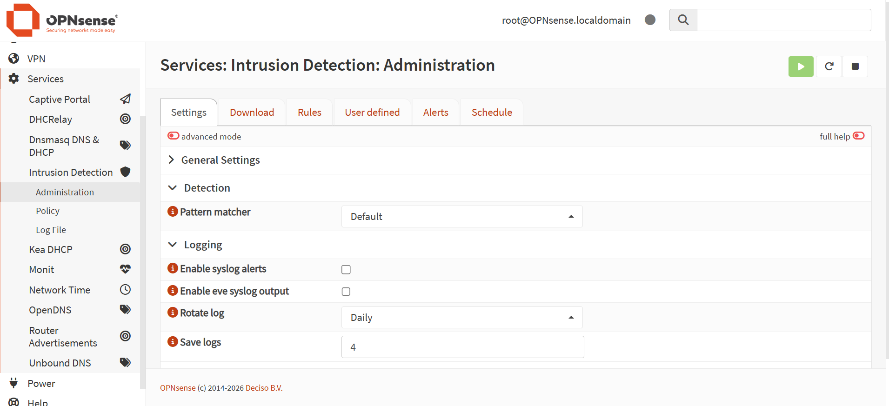
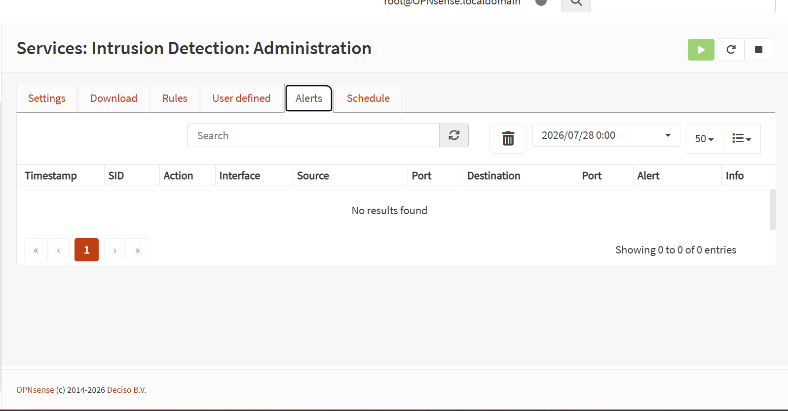
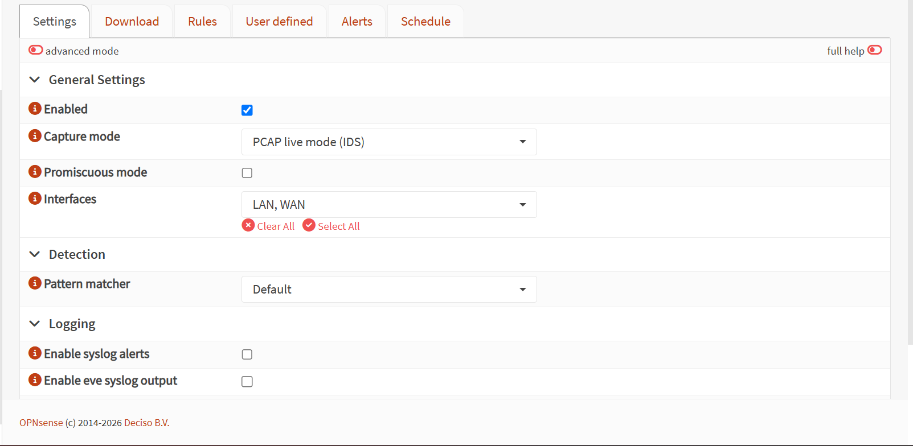
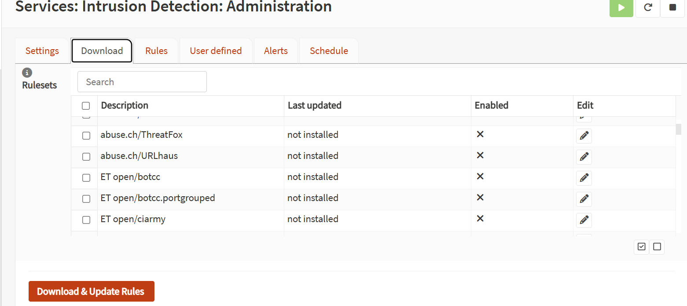
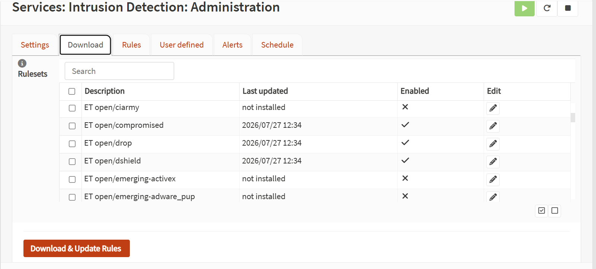
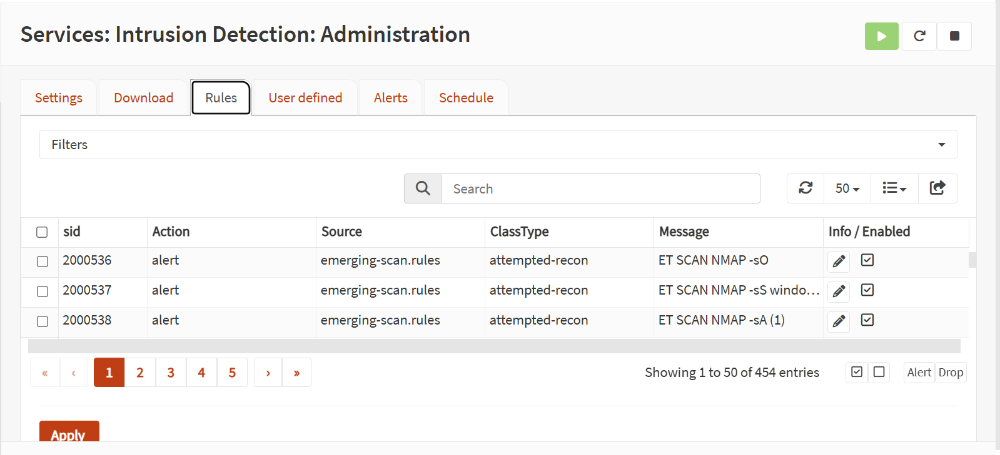
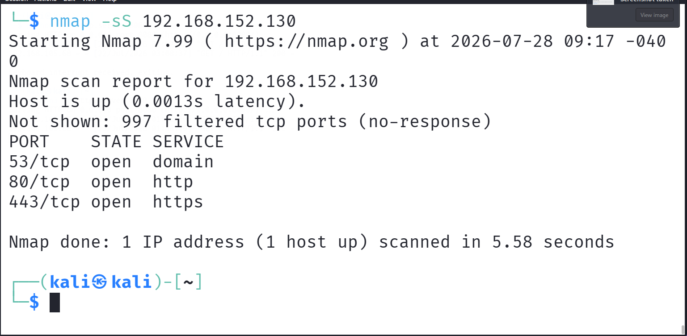
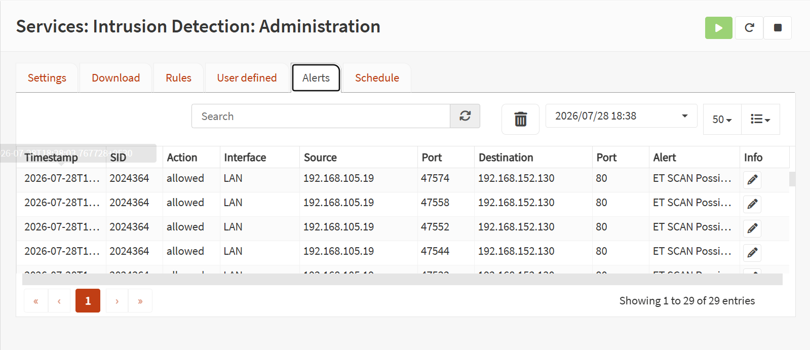

## Lab Overview

Intrusion Detection Systems (IDS) are essential components of modern cybersecurity infrastructures. Unlike traditional firewalls that primarily filter traffic based on predefined rules, an IDS continuously monitors network traffic, performs deep packet inspection, and detects suspicious activities using signature-based and protocol-aware analysis.

In this laboratory, the built-in Suricata Intrusion Detection System (IDS) available in OPNsense was deployed, configured, and validated. Emerging Threats Open (ET Open) rule sets were downloaded and enabled to detect reconnaissance activities. During the deployment process, several configuration and troubleshooting steps were performed to ensure that the IDS engine operated correctly. Finally, reconnaissance traffic generated using Nmap was successfully detected, confirming that Suricata was functioning as expected.

## Objectives

After completing this laboratory, you will be able to:

- Understand the purpose of an Intrusion Detection System (IDS).
- Explain the differences between a firewall, an IDS, and an IPS.
- Configure the built-in Suricata IDS engine in OPNsense.
- Download and manage Emerging Threats Open (ET Open) rule sets.
- Configure IDS monitoring interfaces.
- Troubleshoot common Suricata deployment issues.
- Validate the operational status of the IDS service.
- Generate reconnaissance traffic using Nmap.
- Verify successful intrusion detection through Suricata alerts.

## Prerequisites

Before starting this laboratory, the following requirements were completed:

- OPNsense firewall successfully installed and configured.
- WAN and LAN interfaces configured correctly.
- NAT functionality verified.
- Firewall rules configured and tested.
- Kali Linux connected to the LAN network.
- Ubuntu Linux connected to the WAN network.
- Internet connectivity verified.
- DNS resolution verified.
- Packet Capture and Firewall Logging laboratories completed.

## Lab Environment

| Component | Details |
|-----------|---------|
| Firewall | OPNsense 26.1.6_2 |
| Hypervisor | VMware Workstation Pro |
| Host Operating System | Windows 11 |
| WAN Interface | em0 (192.168.152.130) |
| LAN Interface | em1 (192.168.105.2) |
| Kali Linux | 192.168.105.19 |
| Ubuntu Linux | 192.168.152.132 |
| IDS Engine | Suricata (Built-in) |
| Rule Set | Emerging Threats Open (ET Open) |
| Traffic Generator | Nmap |

## Network Topology

```text
                          Internet
                              │
                       Wi-Fi Router
                      192.168.0.1
                              │
                     Windows Host PC
                    192.168.0.105
                              │
                  VMware Workstation Pro
                 ┌───────────────────────┐
                 │                       │
          VMnet8 (NAT)             VMnet1 (Host-Only)
        192.168.152.0/24          192.168.105.0/24
                 │                       │
     Ubuntu Linux                Kali Linux
   192.168.152.132             192.168.105.19
                 │                       │
                 └────── OPNsense Firewall ──────┘
                        WAN: 192.168.152.130
                        LAN: 192.168.105.2
```

# Part 1 – Understanding Intrusion Detection Systems (IDS)

## What is an Intrusion Detection System (IDS)?

An Intrusion Detection System (IDS) is a security solution designed to monitor network traffic and detect malicious or suspicious activities. Unlike a traditional firewall, which primarily allows or blocks traffic based on predefined rules, an IDS inspects network packets in real time and compares them against known attack signatures, protocol anomalies, and security policies.

The primary objective of an IDS is to identify potential threats and generate alerts that enable security analysts to investigate suspicious activities before they become security incidents.

Suricata is one of the most widely used open-source IDS engines due to its high performance, multi-threaded architecture, and extensive protocol support.

## Why is an IDS Important?

Organizations constantly face cyber threats such as:

- Network reconnaissance
- Port scanning
- Malware communication
- Web application attacks
- Command and Control (C2) traffic
- Data exfiltration attempts

An IDS provides visibility into these activities by continuously inspecting network traffic and notifying administrators whenever suspicious behavior matches predefined detection rules.

Without an IDS, many attacks could remain unnoticed until significant damage has already occurred.

## How Suricata Works

Suricata analyzes every packet that traverses the monitored network interfaces.

Its detection process follows these steps:

1. Capture network packets.
2. Decode network protocols.
3. Reassemble TCP sessions when necessary.
4. Compare packet contents with detection signatures.
5. Generate alerts when suspicious traffic is detected.
6. Store alerts in log files for further investigation.

## Firewall vs IDS vs IPS

Although firewalls, IDS, and IPS are often deployed together, each technology serves a different purpose.

| Technology | Primary Function | Traffic Blocking | Alert Generation |
|------------|------------------|-----------------|-----------------|
| Firewall | Controls network access based on predefined rules | Yes | Limited |
| IDS | Monitors and analyzes traffic for malicious activity | No | Yes |
| IPS | Detects and actively blocks malicious traffic | Yes | Yes |

During this laboratory, Suricata was configured in **IDS mode**, meaning it analyzed network traffic and generated alerts without blocking packets.

In a later laboratory, the deployment will be upgraded to **IPS mode**, where malicious traffic will be automatically blocked.

## Why Suricata?

Suricata was selected for this laboratory because it is one of the most widely adopted open-source intrusion detection and prevention systems.

Its key features include:

- Multi-threaded architecture
- Deep Packet Inspection (DPI)
- Protocol identification
- Signature-based detection
- Threat intelligence integration
- High-performance packet processing
- Native support for Emerging Threats (ET Open) rule sets

These capabilities make Suricata an excellent choice for enterprise environments, Security Operations Centers (SOCs), and cybersecurity laboratories.

This process enables security analysts to detect attacks in real time while maintaining detailed forensic records for incident response.

# Part 2 – Deploying Suricata IDS

## Step 1: Accessing the Intrusion Detection Service

The first step consisted of accessing the built-in Intrusion Detection System (IDS) available in OPNsense.

Navigation path:

```text
Services
    ↓
Intrusion Detection
```

The Intrusion Detection module provides all the components required to deploy and manage Suricata, including:

- Settings
- Download
- Rulesets
- Rules
- Policy
- Alerts
- Administration

Unlike previous versions of OPNsense where Suricata was installed as a plugin, OPNsense 26.1 includes the IDS engine as a built-in feature.

### Figure 1. Intrusion Detection Dashboard

The following screenshot shows the Intrusion Detection dashboard in OPNsense.



## Step 2: Understanding the Intrusion Detection Interface

Before configuring the IDS engine, the available tabs were analyzed to understand their purpose.

| Tab | Purpose |
|------|---------|
| Settings | Configure the IDS engine and monitored interfaces |
| Download | Download rule sets from different providers |
| Rulesets | Manage installed rule categories |
| Rules | Enable or disable individual signatures |
| Policy | Configure rule actions |
| Alerts | Display detected security events |
| Administration | Manage the IDS service |

Each tab plays an important role during the deployment and operation of Suricata.

### Figure 2. Intrusion Detection Interface

The screenshot below presents the different tabs available in the Intrusion Detection module.


## Step 3: Configuring the IDS Engine

Before downloading any signatures, the IDS engine was configured.

The following configuration was applied:

| Parameter | Value |
|-----------|-------|
| Enabled | Yes |
| Capture Mode | PCAP Live Mode (IDS) |
| Promiscuous Mode | Disabled |
| Pattern Matcher | Default |
| Monitored Interfaces | WAN and LAN |

The IDS engine was configured to inspect traffic traversing both network interfaces.

### Figure 3. Suricata IDS Configuration

The following screenshot illustrates the IDS configuration.



## Step 4: Downloading Emerging Threats (ET Open) Rules

Suricata requires rule sets to detect malicious network activity.

The Emerging Threats Open (ET Open) rule sets were selected because they are widely used by security professionals and the cybersecurity community.

Initially, the following rule categories were enabled:

- ET Open Compromised
- ET Open Drop
- ET Open DShield
- ET Open Emerging Scan

After selecting the required categories, the rules were downloaded from the official repository.

### Figure 4. ET Open Rule Selection

The following screenshot shows the selected ET Open rule categories before downloading.



## Step 5: Installing Detection Rules

Once the desired rule categories were selected, the rule database was downloaded and updated.

The installation process successfully imported the signatures into the Suricata engine.

These signatures are later used to compare captured packets against known attack patterns.

### Figure 5. Rule Download Completed

The screenshot below confirms that the rule download completed successfully.



## Step 6: Managing Detection Rules

After downloading the rule sets, the imported signatures were verified in the Rules section.

Each rule contains valuable information including:

- Signature ID (SID)
- Classification
- Rule File
- Description
- Action
- Status

The **Emerging Scan** rules were enabled because they are capable of detecting reconnaissance activities generated by Nmap.

### Figure 6. Enabled Detection Rules

The screenshot below shows the enabled ET Open detection rules.



# Part 3 – First Intrusion Detection

## Step 7: Generating Network Reconnaissance Traffic

After successfully deploying and configuring the Suricata IDS engine, the next objective was to validate its detection capabilities.

To simulate reconnaissance activity, the Nmap network scanning tool was executed from the Kali Linux machine located on the LAN network.

The following command was used:

```bash
sudo nmap -sS 192.168.152.130
```

This command performs a TCP SYN scan against the WAN interface of the OPNsense firewall.

### Figure 7. Nmap SYN Scan

The following screenshot shows the Nmap SYN scan executed from Kali Linux.



## Step 8: Detecting the Scan with Suricata

Immediately after the Nmap scan was executed, the generated traffic was inspected by Suricata.

The IDS engine successfully analyzed the packets and generated alerts indicating reconnaissance activity.

The generated alert confirmed that the deployed IDS was operating correctly and was able to detect suspicious network behavior.

### Figure 8. Suricata Alert

The following screenshot shows the alert generated by Suricata after detecting the Nmap scan.



## Step 9: Alert Analysis

Each alert generated by Suricata provides valuable information that assists security analysts during incident investigation.

The generated alert included the following information:

| Field | Description |
|---------|------------|
| Timestamp | Date and time of the event |
| Source IP | IP address of the attacking host (Kali Linux) |
| Destination IP | Target IP address (OPNsense WAN) |
| Interface | Network interface where the event was detected |
| Rule | Signature that matched the observed traffic |
| Action | IDS action (Alert) |
| Category | Type of detected activity |

This information enables analysts to identify the origin of the activity, determine the targeted system, and understand the nature of the detected threat.
## Step 10: Why Was the Scan Detected?

The detected event was triggered because the installed Emerging Threats (ET Open) signatures contain specific rules designed to identify reconnaissance techniques commonly used during the early stages of cyber attacks.

A TCP SYN scan generates a sequence of packets that matches known Nmap scanning patterns. Suricata compares the observed traffic with its rule database and generates an alert whenever a signature match occurs.

This signature-based detection mechanism allows security analysts to rapidly identify reconnaissance attempts before attackers progress to later stages of an intrusion.

## Step 11: Security Impact

Network reconnaissance is one of the earliest phases of the Cyber Kill Chain.

Attackers typically perform reconnaissance before attempting exploitation in order to identify:

- Open ports
- Running services
- Operating systems
- Potential vulnerabilities

Detecting reconnaissance activities at this stage allows defenders to identify suspicious behavior before a successful attack occurs.

For this reason, reconnaissance detection is considered one of the most important functions of an Intrusion Detection System.

# Part 4 – Results and Analysis

## Step 12: Detection Results

The deployment and validation process confirmed that the Suricata IDS engine was successfully configured and operational.

After executing an Nmap TCP SYN scan from the Kali Linux machine, Suricata successfully detected the reconnaissance activity and generated security alerts.

The generated alerts confirmed that:

- The IDS engine was actively monitoring network traffic.
- The ET Open detection rules were functioning correctly.
- Reconnaissance traffic was successfully identified.
- Alerts were recorded in the OPNsense IDS dashboard.

The successful detection demonstrated that the deployed IDS was capable of identifying suspicious network behavior in real time.
## Step 13: SOC Analyst Perspective

From a Security Operations Center (SOC) perspective, reconnaissance activities are considered one of the earliest indicators of a potential cyber attack.

Port scanning is commonly performed before attackers attempt exploitation because it allows them to discover:

- Live hosts
- Open ports
- Running services
- Operating systems
- Potential attack surfaces

An analyst receiving this alert would immediately investigate:

- The source IP address
- The destination host
- The scanning technique
- The number of scanned ports
- Previous activities associated with the same source

Early detection enables defenders to respond before an attacker progresses to exploitation or lateral movement.
## Step 14: Skills Demonstrated

This laboratory demonstrates several practical cybersecurity skills that are relevant to Security Operations Center (SOC) environments.

The following competencies were successfully demonstrated:

- Deploying an Intrusion Detection System (IDS)
- Configuring Suricata on OPNsense
- Downloading and managing ET Open rule sets
- Troubleshooting IDS deployment issues
- Managing IDS services
- Monitoring network traffic
- Detecting reconnaissance activities
- Interpreting IDS alerts

## Step 15: Lessons Learned

Several important concepts were learned during this laboratory.

First, deploying an IDS involves more than simply installing software. Proper configuration of monitoring interfaces, rule sets, and services is required before detection becomes operational.

Second, troubleshooting is an essential part of IDS deployment. Internet connectivity, DNS resolution, rule downloads, and service status must all be verified before the system can operate correctly.

Finally, successful detection of Nmap reconnaissance traffic demonstrated that Suricata was correctly analyzing network traffic and generating alerts based on signature matching.
## Step 16: Key Takeaways

The following key concepts were reinforced during this laboratory:

- Intrusion Detection Systems provide visibility into network attacks.
- Signature-based detection relies on continuously updated rule sets.
- Proper interface selection is essential for accurate monitoring.
- Network reconnaissance can be detected before exploitation begins.
- Suricata provides valuable security intelligence for SOC analysts.

# Part 5 – Conclusion

## Conclusion

The objective of this laboratory was successfully achieved.

Suricata IDS was deployed, configured, and validated on an OPNsense firewall running in a VMware-based virtual environment.

Emerging Threats Open (ET Open) rule sets were downloaded and enabled to provide signature-based intrusion detection capabilities.

Although several deployment challenges were encountered during the configuration process, systematic troubleshooting techniques were applied to identify and resolve each issue.

The successful detection of an Nmap reconnaissance scan confirmed that the IDS engine was operating correctly and capable of identifying suspicious network activity in real time.

This laboratory establishes a solid foundation for the next series of experiments, which will focus on detecting different reconnaissance techniques, analyzing IDS alerts, and transitioning from Intrusion Detection Systems (IDS) to Intrusion Prevention Systems (IPS).
- Validating security controls using Nmap

